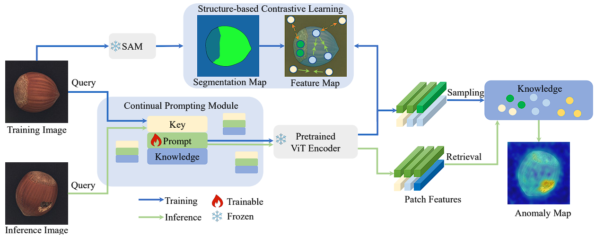

# UCAD for MVTec LOCO AD dataset




Offical code for *Unsupervised Continual Anomaly Detection with Contrastively-learned Prompt* in AAAI-2024 [[paper link]](https://ojs.aaai.org/index.php/AAAI/article/view/28153) [[github link]](https://github.com/shirowalker/UCAD)

Jiaqi Liu*, Kai Wu*, Qiang Nie, Ying Chen, Bin-Bin Gao,Yong Liu, Jinbao Wang, Chengjie Wang, Feng Zheng†

## Environment

### Basic
python>=3.8, torch>=1.12, CUDA>=11.3, timm==0.6.7

The `requirements.txt` file contains all the necessary libraries.

### Install SAM:
Install it via the `requirements.txt` or clone the repository locally and install with
```bash
git clone git@github.com:facebookresearch/segment-anything.git
cd segment-anything; pip install -e .
```
