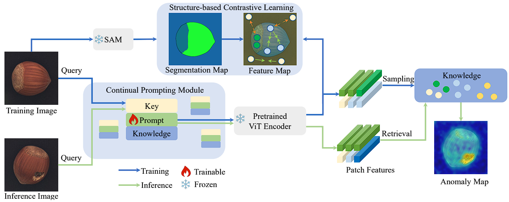

# UCAD for MVTec LOCO AD dataset




Offical code for *Unsupervised Continual Anomaly Detection with Contrastively-learned Prompt* in AAAI-2024 [[paper link]](https://ojs.aaai.org/index.php/AAAI/article/view/28153) [[github link]](https://github.com/shirowalker/UCAD)

Jiaqi Liu*, Kai Wu*, Qiang Nie, Ying Chen, Bin-Bin Gao,Yong Liu, Jinbao Wang, Chengjie Wang, Feng Zheng†

## Environment

### Basic
python>=3.8, torch>=1.12, CUDA>=11.3, timm==0.6.7

The `requirements.txt` file contains all the necessary libraries.

### Install SAM:
Install it via the `requirements.txt` or clone the repository locally and install with
```bash
git clone git@github.com:facebookresearch/segment-anything.git
cd segment-anything; pip install -e .
```

## Prepare for training
Rename the dataset dir to `mvtec2d` and create sam senmantic dir
(processed mvtec2d-sam-b.zip is provided in repository)
```bash
cp -r $mvtec_origin_data_path('./mvtec2d') $mvtec_data_path('./mvtec2d-sam-b')
cd UCAD/segment_anything
python3 dataset_sam.py --sam_type 'vit_b' --sam_checkpoint $your_sam_path --data_path $mvtec_data_path
```

## Training and evaluation
Environment prepare:
```bash
datapath=/hhd3/m3lab/data/mvtec2d datasets=('bottle' 'cable' 'capsule' 'carpet' 'grid' 'hazelnut' 'leather' 'metal_nut' 'pill' 'screw' 'tile' 'toothbrush' 'transistor' 'wood' 'zipper')
dataset_flags=($(for dataset in "${datasets[@]}"; do echo '-d '$dataset; done))
```

<!-- datapath=/hhd3/m3lab/data/visa datasets=('candle' 'capsules' 'cashew' 'chewinggum' 'fryum' 'macaroni1' 'macaroni2' 'pcb1' 'pcb2' 'pcb3' 'pcb4' 'pipe_fryum') -->
Training:
```bash
CUDA_VISIBLE_DEVICES=0 python3 run_ucad.py --gpu 0 --seed 0 --memory_size 196 --log_group IM224_UCAD_L5_P01_D1024_M196 --save_segmentation_images --log_project MVTecAD_Results results ucad -b wideresnet50 -le layer2 -le layer3 --faiss_on_gpu --pretrain_embed_dimension 1024 --target_embed_dimension 1024 --anomaly_scorer_num_nn 1 --patchsize 1 sampler -p 0.1 approx_greedy_coreset dataset --resize 224 --imagesize 224 "${dataset_flags[@]}" mvtec $datapath
```
